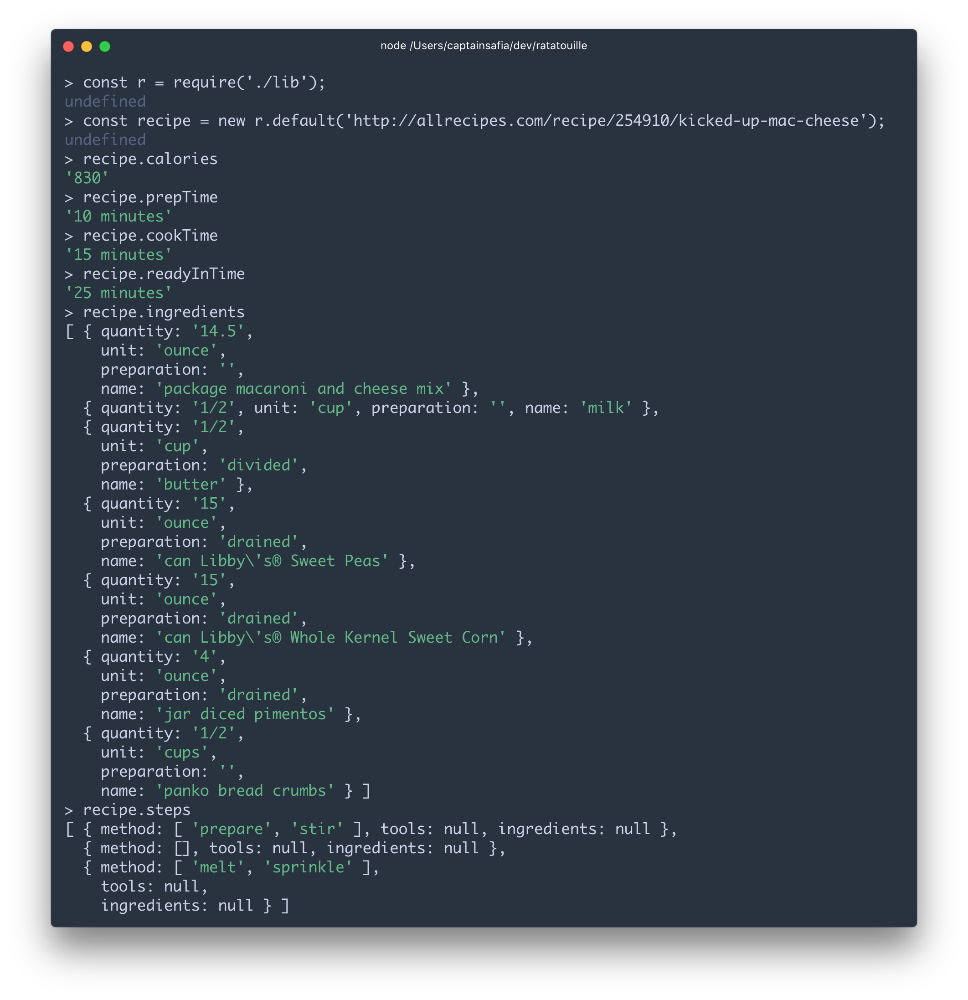

# ratatouille

ratatouille is a Node.js scrapper for allrecipes.com. It allows you to
extract basic information about a recipe, the ingredients required, and
the steps involved.

### Installation

```
npm install @captainsafia/ratatouille
```

### Usage

```
> import Ratatouille from 'ratatouille';
> const recipe = Ratatouille.load('http://allrecipes.com/recipe/254910/kicked-up-mac-cheese').then(function(html) {
                                                                                                                  return new Ratatouille(html);
                                                                                                            }});
> recipe.readyInTime
'25 minutes'
> recipe.prepTime
'10 minutes'
> recipe.cookTime
'15 minutes'
> recipe.calories
'830'
> recipe.ingredients
[ { quantity: '14.5',
    unit: 'ounce',
    preparation: '',
    name: 'package macaroni and cheese mix' },
  { quantity: '1/2', unit: 'cup', preparation: '', name: 'milk' },
  { quantity: '1/2',
    unit: 'cup',
    preparation: 'divided',
    name: 'butter' },
  { quantity: '15',
    unit: 'ounce',
    preparation: 'drained',
    name: 'can Libby\'s® Sweet Peas' },
  { quantity: '15',
    unit: 'ounce',
    preparation: 'drained',
    name: 'can Libby\'s® Whole Kernel Sweet Corn' },
  { quantity: '4',
    unit: 'ounce',
    preparation: 'drained',
    name: 'jar diced pimentos' },
  { quantity: '1/2',
    unit: 'cups',
    preparation: '',
    name: 'panko bread crumbs' } ]
```


